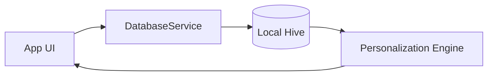

# FocusMate: Database & Cloud Integration Guide

FocusMate uses a hybrid storage model to ensure fast offline access and reliable cloud synchronization.

## 1. Local Storage: Hive
Currently, the app uses **Hive**, a lightweight and blazing-fast key-value database written in pure Dart.

### How it's used:
- **`settings` box**: Stores user preferences (e.g., last used study method).
- **`history` box**: Stores every focus session record (date, topic, focus score, distractions, notes).
- **`playlists` box**: Stores user-created playlists and their associated YouTube video IDs.
- **Analyics**: Hive allows us to quickly query recent sessions to generate "Topic Chips" and recommendations without network latency.

### Data Flow:

## 2. Cloud Integration: Firebase
We are now integrating **Firebase** to provide cross-device synchronization and secure user authentication.

### Connections:
1. **Authentication (Firebase Auth)**:
   - Uses **Google Sign-In** to identify users.
   - Provides a unique `uid` (User ID) to isolate data.
2. **Database (Cloud Firestore)**:
   - Synchronizes `History` and `Playlists` boxes.
   - Collections: `users/{uid}/history` and `users/{uid}/playlists`.

### Sync Pattern (Cache-First):
- The app always reads from **Hive** first for instant UI response.
- When a new session is saved, it is written to **Hive** immediately.
- A background service then pushes the update to **Firestore**.
- On login/start, the app pulls missing records from **Firestore** into **Hive**.

## 3. How to Connect Your Own Firebase
To make the cloud sync active, follow these steps:

1. **Create Project**: Go to [Firebase Console](https://console.firebase.google.com/) and create a new project called "FocusMate".
2. **Enable Services**:
   - Authentication (Enable Google Sign-In).
   - Firestore Database (Start in test mode or create rules).
3. **Add App**:
   - Register your Android app (package name: `com.focusmate.focusmateapp`).
   - Register your iOS app.
4. **Config Files**:
   - Download `google-services.json` and place it in `android/app/`.
   - Download `GoogleService-Info.plist` and place it in `ios/Runner/`.
5. **API Keys**:
   - Ensure the Google Cloud project matches your Firebase project to sharing the same OAuth client IDs.

> [!TIP]
> I have already included the necessary Flutter dependencies. Once you place the config files, the app will automatically start using the Firebase credentials.
