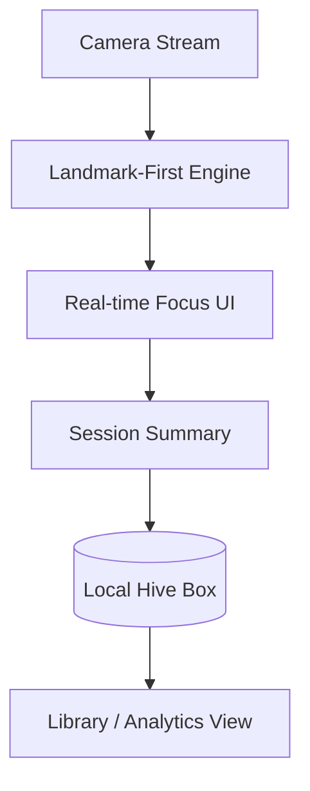

# FocusMate: Database & Privacy Guide

FocusMate is built on a **100% Local-First** architecture. This ensures maximum speed and absolute privacy for students, as no personal study data or camera-derived metrics ever leave the device.

## 1. Data Layer: Hive
The application uses **Hive**, a high-performance key-value database written in pure Dart. Hive is significantly faster than SQLite or Firebase for the real-time scoring needs of this project.

### Core Data Boxes:
- **`settings`**: Persists user preferences (e.g., Active ML Model, Theme).
- **`history`**: Stores detailed session records including:
    - Focus Score & Grade (A+ to D)
    - Distraction counts
    - Study notes & Titles
    - Video metadata & Timestamps
- **`saved_videos`**: Stores bookmarked educational content for the Library.
- **`viewed_videos`**: Tracks video history to avoid redundant searches.

## 2. Privacy-First Architecture
Because attention detection involves camera data, we have intentionally avoided Cloud integration (Firebase/Firestore):
- **Local Inference**: ML models run on the device's CPU/GPU via TFLite.
- **Zero Sync**: Your study habits and notes are private to your phone.
- **Speed**: Session statistics are available instantly without waiting for an internet connection.

## 3. Data Flow

> [!NOTE]
> All session analytics, including focus grades and distraction alerts, are stored in the `app_documents` directory of the Android system, managed by the Hive persistence layer.
